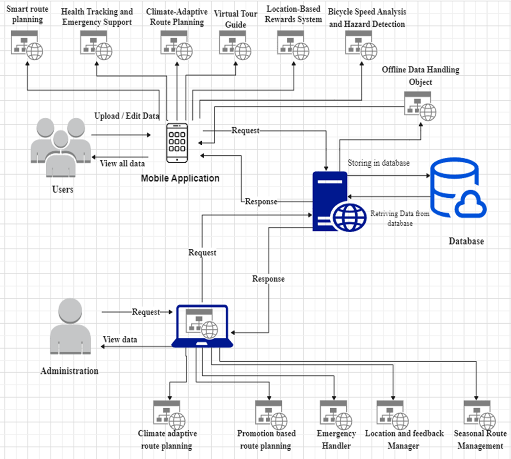

EcoCycle Explorer
AI-Driven Approach for Sustainable Bicycle Tourism Development in Sri Lanka

This project leverages artificial intelligence to enhance sustainable tourism through bicycle tourism in Sri Lanka. It focuses on optimizing routes, ensuring user safety, and promoting eco-friendly practices while integrating local cultural and environmental factors.

Here’s a GitHub README file draft based on the "EcoCycle Explorer" project details from the presentation you provided:

---

# EcoCycle Explorer

**AI-Driven Approach for Sustainable Bicycle Tourism Development in Sri Lanka**

This project leverages artificial intelligence to enhance sustainable tourism through bicycle tourism in Sri Lanka. It focuses on optimizing routes, ensuring user safety, and promoting eco-friendly practices while integrating local cultural and environmental factors.

---

## Table of Contents

1. [Overview](#overview)
2. [Architectural Diagram](#architectural-diagram)
3. [Technologies and Dependencies](#technologies-and-dependencies)

---

## Overview

### Project ID:
24-25J-217

### Supervisors:
- Dr. Samantha Rajapaksha  
- Mr. Nelum Chathuranga Amarasena

### Team Members:
- Bandara R.M.D.L (Team Leader)  
- Bandara K.M.V.T  
- Chandrasena H.M.K.G.J.K  
- Kumara M.G.S.D  

### Objective:
To develop an AI-driven mobile application to:
- Enhance sustainable bicycle tourism in Sri Lanka.
- Provide optimized cycling routes based on real-time data.
- Promote eco-friendly and culturally rich tourism practices.

### Key Features:
- AI-driven route optimization.
- Real-time data integration (weather, traffic, and hazards).
- Voice navigation and multi-language support.
- Road condition analysis and hazard detection.
- Health tracking and emergency support.
- Gamified features to enhance user engagement.

---

## Architectural Diagram

This diagram should highlight:
- AI-driven route planning and optimization.
- Real-time data feeds for weather, road conditions, and user health monitoring.
- Features for voice navigation and hazard detection.
- 

---

## Technologies and Dependencies

The project uses the following technologies and tools:

### Programming Languages and Frameworks:
- **Python** (AI and backend)
- **JavaScript** (Frontend and mobile app development)
- **React.js** and **React Native** (Frontend frameworks)
- **Node.js** (Backend framework)

### Machine Learning:
- **TensorFlow**: For training AI models.
- **OpenCV**: For real-time computer vision.

### Data and APIs:
- **Google Maps API**: For route planning and navigation.
- **OpenWeatherMap**: For real-time weather updates.
- **Kaggle Datasets**: For training AI models.

### Additional Tools:
- **Mongodb**: For database
- 

---

## How It Works

1. **Route Optimization**: AI suggests personalized routes based on user preferences, weather, and road conditions.
2. **Hazard Detection**: AI analyzes real-time data to alert cyclists about potential dangers.
3. **Voice Navigation**: Multilingual voice-guided navigation ensures cyclists stay informed without distractions.
4. **Health Monitoring**: Tracks vital signs and triggers emergency alerts if necessary.
5. **Cultural Integration**: Highlights eco-friendly routes and culturally significant landmarks.

---

